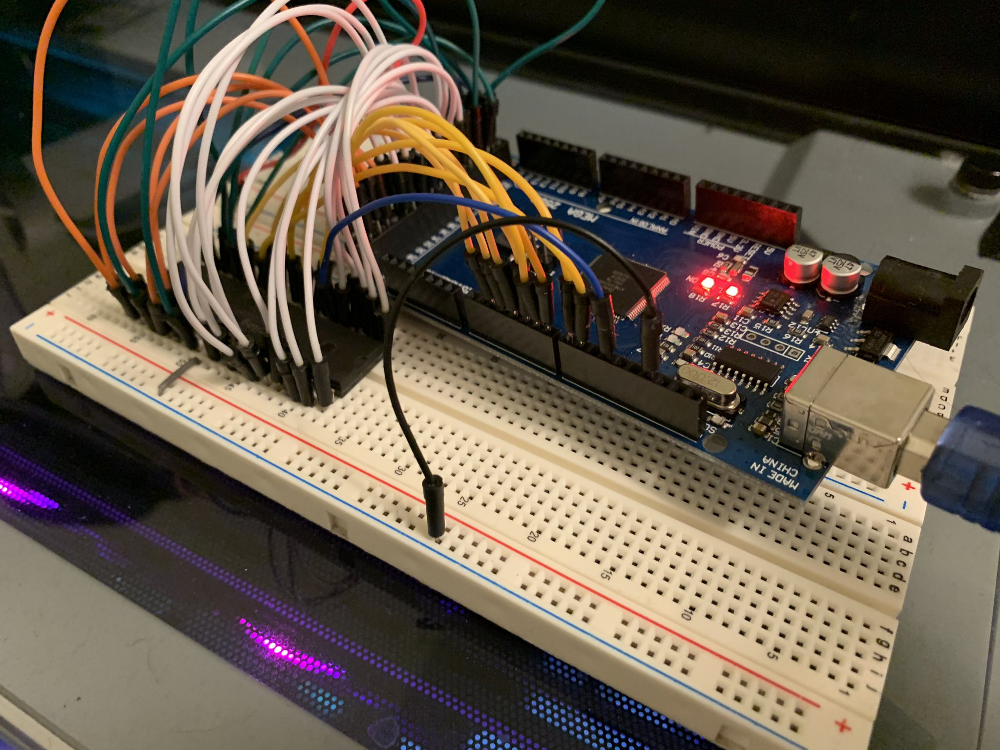

# Zard80

*Run your Z80 with only an Arduino Mega or similar.*

---

Zard80 is simple: Just wire up every pin on your Z80 to an available digital pin on your Arduino (except VCC and GND,
obviously!) and you're good to go!

This should work for modern, CMOS-based Z80s - older NMOS chips reportedly don't appreciate being severely
under-clocked.

If running outside of PlatformIO, Set your Serial Monitor's baud rate to 115200.

## Configuration

Details like Arduino pinout, system memory size, and debug event logging are configurable:
 - Edit `include/pins.h` to remap the pinout.
 - Edit `include/z80mem.h` to change the memory size.
 - Edit `include/event.h` to change debug event logging capacity.

## Behaviour

Before starting the Z80, Zard80 will wait for Serial to connect, and print `[Zard80] Online` to Serial. 

Z80 IO Port 0 is mapped to Serial I/O. When reading from port 0, a response of `0xFF` indicates that no character is
available to be read.

Zard80 will terminate and print debug events whenever:
 - The instruction `HALT` is executed on the Z80 (HALT pin is set to low.)
 - An instruction fetch, memory read, or memory write goes beyond the configured memory size.
 - An IO Read or Write is made to an unmapped port (i.e., any except for port zero.)

In these scenarios, the reason for termination will be printed, followed by all logged
debug events. The bottom-most debug event is typically the one that caused the termination.

## Assembling a Z80 Program

### The Proper Way

To assemble the Z80 program for Zard80, You will need zasm (http://k1.spdns.de/Develop/Projects/zasm/Distributions/) in your path, as well as
the `xxd` command.

Place your assembly in `main.z80` and run `assemble-z80.sh` (linux/mac/UNIX) or `assemble-z80.bat` (windows).

On Windows, `xxd` can be installed via chocolatey.
Other platforms should (hopefully) have both available in their package managers.

### The Quick One-Off Way

Having trouble? In a pinch, you can also compile your Z80 assembly using [asm80.com](https://www.asm80.com/), and then
use this [file to C array converter](https://notisrac.github.io/FileToCArray/) - simply copy the contents of the array
up until the point where all that remains is a load of `0x00` (some extra 0s on the end is fine), and paste them over
the existing data in `src/z80mem.cpp`.
